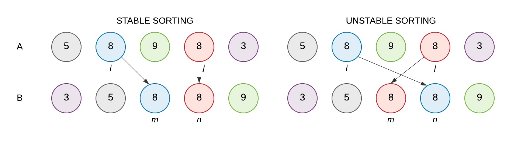

# Insertion Sort Algorithm

### Sorting Mechanism:

The sorting mechanism is very trivial, It's to consider the first element to be sorted, and all the elements after to be compared with the previous elements, if the element is smaller than it's precednt we swap them. In very simple steps we do the following: 

* mark first element as sorted
* for each unsorted element X
    - 'extract' the element X
    
* for j = lastSortedIndex down to 0
    - if current element j > X
        * move sorted element to the right by 1

* break loop and insert X here

***
### Time & Space Complexity
- The Time Complexity for Insertion sort algorithm is : O(N2)
- The Auxiliary Space Complexity for Insertion sort algorithm is : O(1)

***

### Stable Algorithm
First things first, let's define what a stable algorithm is...
> a **Stable Sorting Algorithm** is an algorithm which sorts the elements while keeping them in order

For Example:  
<tab>if we have a list of elements as follows: 9 6 7 6 8\
<tab>so their indices are : 1 2 3 4 5\
 
<tab>after sorting them using a stable algorithm we would have the following:\
<tab>6 6 7 8 9\
<tab>with reference to their indicies **before** sorting would be:\
<tab>2 4 3 5 1

Hope you like it :black_heart:	:handshake:	

